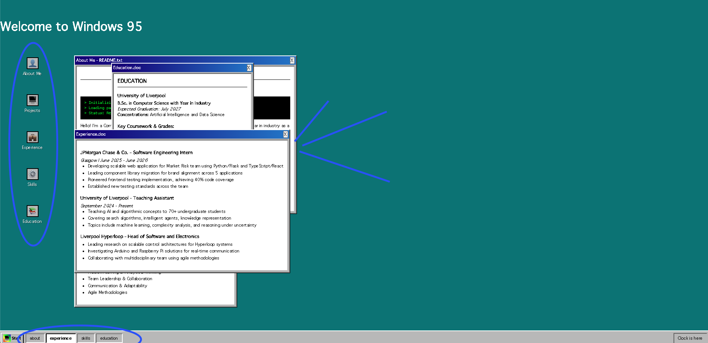

# Windows 95 Portfolio 🪟

A nostalgic Windows 95-themed portfolio built with React. Finally decided on a theme I liked and thought this would be perfect for it.

🔗 **Live Demo:** [https://windows-95-portfolio-three.vercel.app/](https://windows-95-portfolio-three.vercel.app/)

## Features

- Authentic Windows 95 UI design
- Interactive desktop with clickable icons
- Multiple draggable windows (About, Experience, Projects, Skills, Education, Contact)
- Working taskbar with window management
- Z-index window layering (click to focus)
- Retro pixel font (VT323)
- Mobile responsive
- ASCII art terminal animations (doesn't do anything lol)

## Planned Features
- Adding actual 95 icons
- Loading screen just like the OG
- Migration to typescript

## Built With

- **React** - Component-based UI
- **CSS3** - Retro Windows 95 styling
- **Vercel** - Deployment and hosting
- **VT323 Font** - Authentic retro typography

